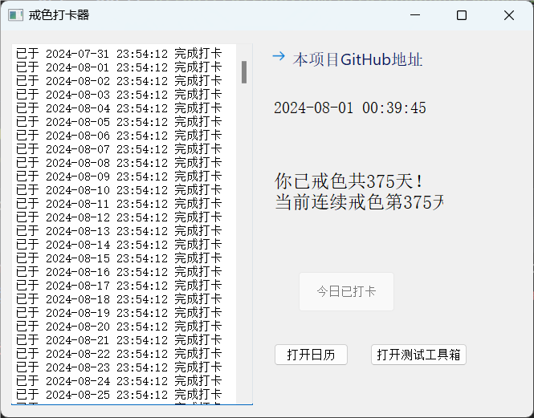
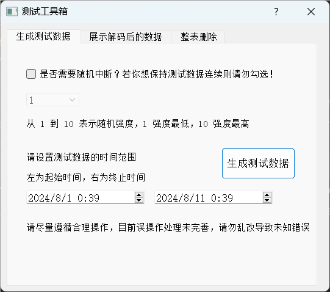
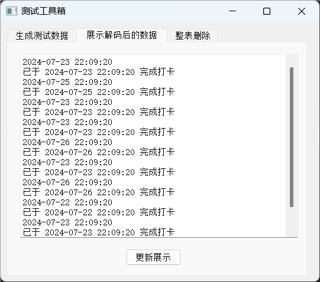
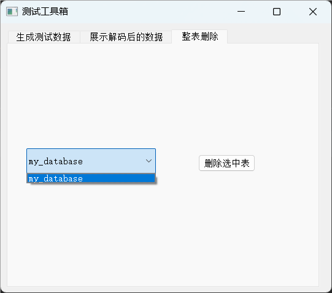
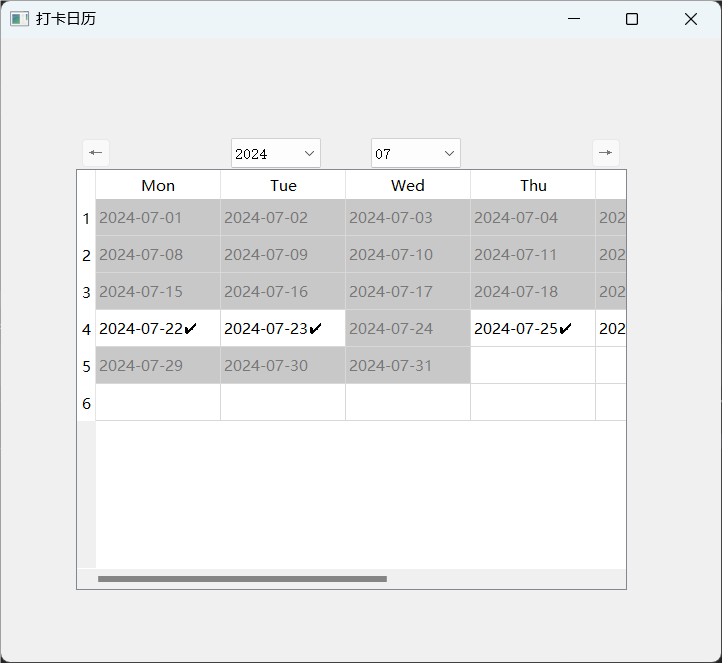

# 这是什么？

---

一个整活用的小软件，给群友们开发的本质打卡类玩意儿

# 当前版本

---

***2.0版***

- 终于赶工完成了日历功能，目前还未经过有效测试

- 移除了UI的拉伸限制，随便拉伸吧，反正不影响使用

- 估计有大量潜在BUG？以及先前功能的进一步完善也还需要努力

- 之后应该会连着出几个小版本做BUG Fix之类的，不着急
  
  

# 更新计划

---

进行中

- 预计加入日历功能，可直观通过日历查看打卡情况，已打卡日期则✔，没打卡要不要显示什么还在讨论
  
  

已放弃/已完成

- <u>如果可以的话把文件存储改为真正的数据库存储，计划使用sqlite</u> （已完成✔）

- <u>美化ui，说实在的pyqt的designer搞ui都搞不熟练搞的头大，能美化一下的话还是美化好（已永久性放弃美化）</u>
  
  

还未开始

- None
  
  

# 版本历史

---

***1.1版***

* 完成对数据存取的重构，现在已经完全从txt文件存取重构为sqlite存取

* txt版本使用hex对数据进行编码，当前sqlite使用base64对数据进行编码

* 大幅完善了测试功能，将测试所需的增删查整合起来，不含改，且更新了GUI版本的测试工具箱

* 测试方面的东西都放在test文件夹中了

* 稍微修改了UI的设置，现在不可拉伸UI窗口了

* 效仿Django添加了配置文件夹和文件，现在项目的可移植性和可拓展性更好了
  
  

***1.0初始版***

* 使用文件进行数据存储

* 统计戒冲打卡总天数和连续天数

* 每日只可打卡一次，通过系统时间进行判断

* pyqt制作的简陋ui
  
  

# 程序示例

这是主要的使用窗口

这是测试工具箱的三个界面

这是日历功能

# 使用说明

---

每天限打卡一次，统计打卡总次数和最新的连续次数

已新增测试工具箱和打卡日历
